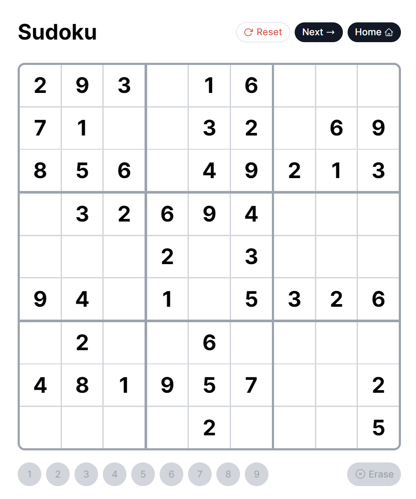

# Sudoku Game

Available at: https://sudoku-game-ang-zeyus-projects.vercel.app/

## Tech Stack

- Next.js (App Router)
- [Supabase](https://supabase.com/)
- Tailwind CSS
- Vercel

## Features

- Initially server side rendered landing page subsequently with client side infinite loading
- Server rendered game board pages
- Limited content layout shift transitioning across game boards with `startTransition` and localised `<Suspense>` boundaries in the landing page
- Next.js caching capabilities leverage to the fullest, under key assumptions below
- Keyboard operable sudoku board
- Cell highlighting for success/error/playing states

## Key Assumptions & Solutions Otherwise

- A potentially large list of hardcoded games are loaded from Supabase and there are no user-supplied puzzles; Content managers are OK with re-trigerring a build process somewhere that revalidates the Next.js caches.
  - This allows leveraging Next.js caching capabilities to it's fullest:
    - Full route cache
      - Caching the landing page that server renders the first 10 puzzles
      - Caching the first N (currently hardcoded to 3) game board pages, which (for example) may be the most popular game boards
      - Caching dynamically cached game board pages after the first N
    - Data Cache
      - Caching client-side infinite scrolling data fetches for the landing page from Supabase
  - Solution otherwise:
    - If user supplied puzzles are accepted, we may `revalidatePath/Tags` in the server action processing the user created puzzle
    - If real-time capabilities are absolutely required,
      - Supabase cache must be invalidated. This [thread](https://github.com/orgs/supabase/discussions/20022#discussioncomment-8201669) provides various solutions.
      - Route caching must be disabled (e.g. `export const revalidate = 0`)
- Being a user-agnostic project, board validation is done completely client-side.
  - If user tracking functionality is required (e.g. high scores)
    - Doing it via a server action or otherwise may be more secure

## Previews

## Attributions

- Sudoku favicon: <a href="https://www.flaticon.com/free-icons/sudoku" title="sudoku icons">Sudoku icons created by Freepik - Flaticon</a>
